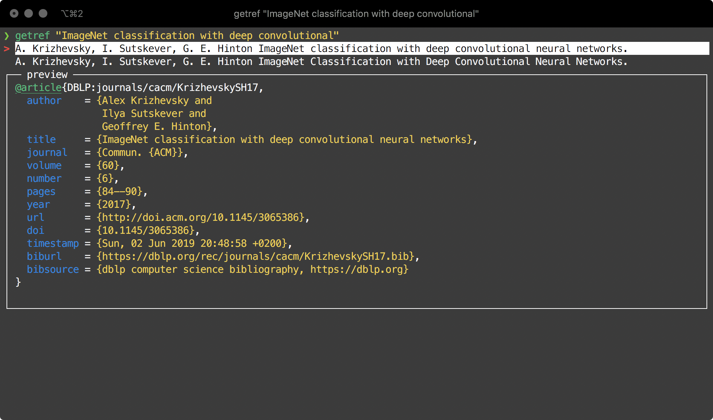

[](https://badge.fury.io/py/getref) 

# getref

Command line interface to [dblp](dblp.org).



## Installation

```
pip install getref
```

## Usage

```
getref QUERY
```

Or pipe into file

```
getref QUERY >> references.bib
```


